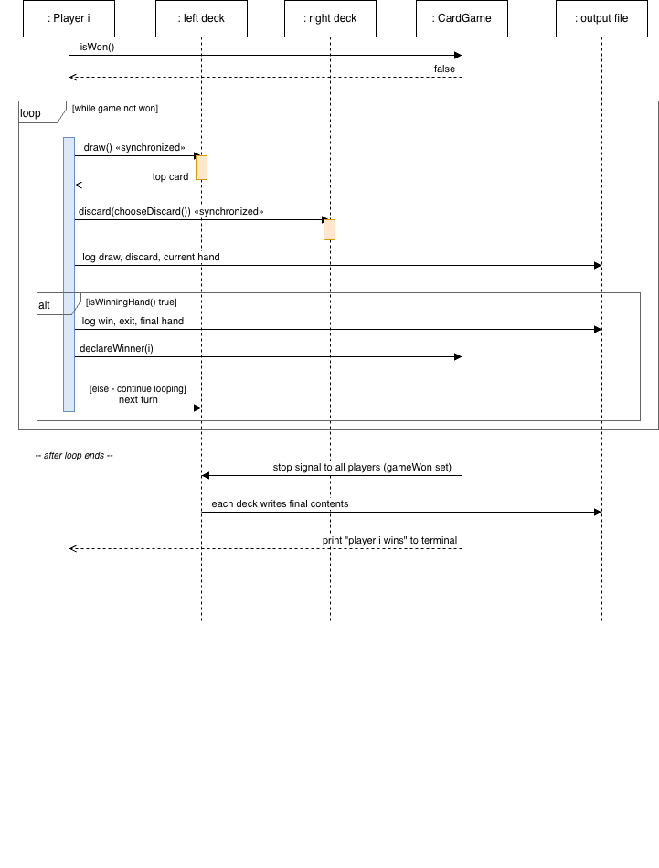

# Multi-threaded Card Game Simulation (Java)

A concurrent card game where **every player runs on its own thread**. Players sit in a ring of shared card decks: each one draws from the deck on its left and discards to the deck on its right, until someone holds four of a kind. The project focuses on correct, deadlock-free concurrency, clean class design and thorough unit testing (47 JUnit 5 tests).

## How the game works

1. The user enters the number of players `n` and the path to a **pack file**. The pack must contain exactly `8n` lines, each a non-negative integer.
2. The first `4n` cards are dealt round-robin into the players' hands (4 cards each). The remaining `4n` fill the `n` decks.
3. Player `i` prefers cards of value `i`. On each turn it draws from deck `i`, then discards a non-preferred card at random to deck `i+1`.
4. The first player to hold **four cards of the same value** prints `player i wins`, and all threads stop cleanly.
5. The game writes `2n` log files: one per player (every draw, discard and hand) and one per deck (its final contents).

```
        deck1 ──▶ player1 ──▶ deck2 ──▶ player2 ──▶ deck3
          ▲                                           │
          └──── player4 ◀── deck4 ◀── player3 ◀───────┘
```

## Concurrency design

- **One thread per player:** players take turns simultaneously, not in sequence.
- **Thread-safe decks:** `CardDeck` exposes only `synchronized` methods, so a draw or discard is atomic.
- **No deadlocks:** a player never holds two locks at once. It interacts with its left deck, then its right deck.
- **Lock-free game-over signal:** the win flag and winner ID are `AtomicBoolean` and `AtomicInteger`. The winner ID is set before the flag, so every thread sees a consistent result.
- **Atomic turns:** players check the game-over flag only *between* turns, so no player stops halfway through a draw-and-discard.
- **No busy-waiting:** if a player's left deck is momentarily empty, it yields instead of spinning.

## Project structure

```
src/card/
├── CardGame.java            # entry point: input, validation, thread start/join, output
├── Player.java              # Runnable: hand, strategy, win detection, per-player log
├── CardDeck.java            # thread-safe FIFO deck
├── Card.java                # immutable card value
├── Dealer.java              # round-robin dealing of hands and decks
├── PackReader.java          # pack file parsing and validation
└── InvalidPackException.java
test/card/                   # JUnit 5 tests for every class (47 tests)
pack/four_rigged.txt         # sample 4-player pack where player 1 wins immediately
report/                      # user stories, use-case, class and sequence diagrams (draw.io)
```

## Run it

Requires Java 17+.

```bash
javac -d out src/card/*.java
java -cp out card.CardGame
```

When prompted, enter `4` players and the pack path `pack/four_rigged.txt`. The game uses pop-up dialogs if a display is available and falls back to terminal prompts otherwise.

**Tests:** open the project in Eclipse or IntelliJ (JUnit 5 is on the classpath) and run everything under `test/`.

## Design documentation

The `report/` folder contains the user stories with acceptance criteria and UML diagrams.

| Class diagram | Sequence diagram |
|---|---|
|  |  |

## Tech stack

Java · `java.util.concurrent` (atomics, threads) · JUnit 5 · draw.io (UML)

## Author

**Arush Kumar Vishwakarma**, [GitHub](https://github.com/Arush70)
